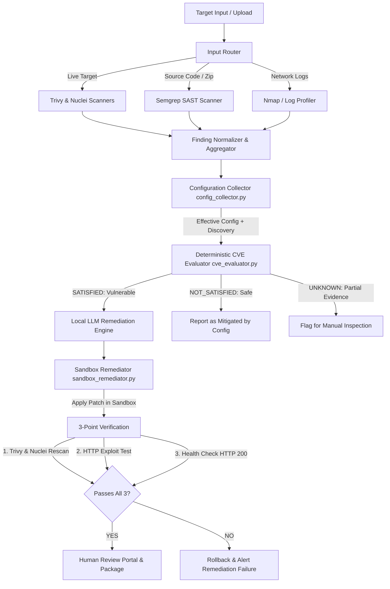

# AirGap Security System: Comprehensive End-to-End Architectural Report

**Document Version:** 2.0  
**Project:** AirGap Security Platform  
**Target Environments:** Air-gapped / Offline Enterprise Networks, Containerized Applications, Web Services  
**Target Workload Tested:** Apache Tomcat Enterprise Server (`tomcat-9.0.98-vuln`)

---

## 1. Executive Summary: What is this Project and Why Do We Need It?

### 1.1 The Core Problem
In traditional cybersecurity operations:
1. **Cloud Dependency:** Most modern scanners (Snyk, SonarQube Cloud, GitHub Dependabot) require continuous internet connectivity to cloud databases and API endpoints. High-security environments—such as financial networks, defense installations, air-gapped critical infrastructure, and isolated SCADA systems—cannot use these tools without violating compliance and security boundaries.
2. **False Positives from Naive Scanners:** Traditional scanners look only at package versions (e.g., "Tomcat 9.0.98 has CVE-2025-24813"). However, real-world exploitability almost always depends on environmental configuration (e.g., whether `readonly` is false in `DefaultServlet`, whether session persistence is file-based, whether specific authentication realms or AJP ports are exposed). As a result, security teams waste 80% of their time chasing false positives.
3. **The Remediation Risk:** Automatically applying security patches to production workloads can cause catastrophic service outages. If a configuration parameter breaks application dependencies or crashes the servlet engine, the fix is worse than the vulnerability.

### 1.2 The AirGap Security Solution
The **AirGap Security Platform** is a 100% offline, autonomous security auditing, deterministic vulnerability evaluation, and safe sandbox remediation platform.

```
                           AIRGAP SECURITY PLATFORM
┌─────────────────────────────────────────────────────────────────────────────┐
│ 1. Multi-Modal Ingestion (Source Archives, Network Logs, Live Containers)   │
│                                    ↓                                        │
│ 2. Dual-Scanner Tier (Trivy Package Scanner + Nuclei Live HTTP Scanner)     │
│                                    ↓                                        │
│ 3. Deep Environmental Collector (CVE-Agnostic Config & Discovery Engine)   │
│                                    ↓                                        │
│ 4. Deterministic CVE Evaluator (Precondition Satisfaction Rules)            │
│                                    ↓                                        │
│ 5. Air-Gapped Local LLM Remediation Planner (Patch & Config Generation)     │
│                                    ↓                                        │
│ 6. Isolated Sandbox Remediator (Test Container Fix Deployment)              │
│                                    ↓                                        │
│ 7. 3-Point Verification (Rescan Zero, Exploit Block, Service Health OK)    │
│                                    ↓                                        │
│ 8. Human Review Gate (Cryptographic Evidence Portal & Sign-off)             │
└─────────────────────────────────────────────────────────────────────────────┘
```

The system operates strictly within air-gapped boundaries:
- **No external API calls:** Uses local CVE knowledge bases and local LLMs (Ollama / vLLM).
- **Zero secrets leakage:** Never stores or transmits passwords, private keys, or tokens.
- **Evidence-based deterministic logic:** Exploitability is evaluated using mathematical precondition checking, not fuzzy guessing.
- **Fail-safe sandbox verification:** No change is ever applied to production without being tested and proven in an isolated sandbox container.

---

## 2. End-to-End System Architecture & Workflow

The platform operates through an 8-stage automated pipeline:



### Stage 1: Ingestion & Input Routing (`input_router.py`)
- Ingests ZIP code bundles, network logs (`.log`, `.txt`, `.jsonl`), or live container identifiers.
- Classifies input type without human intervention and routes the artifact to the appropriate analysis pipeline.

### Stage 2: Dual Scanning Tier (`trivy_scanner.py`, `nuclei_scanner.py`)
- **Trivy:** Discovers vulnerable software dependencies, JAR libraries, and operating system packages.
- **Nuclei:** Sends live HTTP/web-service probes to detect active exposures (e.g., exposed Tomcat manager interfaces, default credentials, exposed documentation, misconfigured servlets).

### Stage 3: CVE-Agnostic Environmental Collection (`config_collector.py`)
- Introspects the target container without making assumptions.
- Extracts active configuration only (stripping all commented-out XML).
- Collects structured evidence across 14 security domains (DefaultServlet, Session Persistence, Authentication, Realms, TLS, Security Constraints, Management Apps, AJP, Proxies, Deployment, etc.).
- Executes **Generic Configuration Discovery**: automatically catalogues unknown active XML elements and unrepresented attributes across any Tomcat version (9.x, 10.x, 11.x) without hardcoded schemas.
- Strict secrets sanitization: completely redacts passwords, keystores, and credentials.

### Stage 4: Deterministic CVE Evaluation (`cve_evaluator.py` & `cve_knowledge.json`)
- Evaluates raw scanner findings against environmental preconditions.
- Replaces subjective LLM guessing with deterministic Boolean logic:
  - **`SATISFIED`:** Version is vulnerable AND all runtime conditions necessary for exploitation are active.
  - **`NOT_SATISFIED`:** Version is flagged by raw scanner, but server configuration prevents exploitation (e.g. `readonly=true` disables PUT exploitation).
  - **`UNKNOWN`:** Required configuration parameters cannot be definitively established.

### Stage 5: Air-Gapped Local LLM Remediation (`local_llm.py`, `remediation_engine.py`)
- Connects to an air-gapped local model (Ollama running `deepseek-r1`, `llama3`, or `qwen2.5-coder`).
- Generates precise surgical configuration edits (e.g., modifying `web.xml` or `context.xml`) rather than recommending arbitrary software upgrades that break compatibility.

### Stage 6: Isolated Sandbox Execution (`sandbox_remediator.py`)
- Creates an isolated Docker sandbox container mimicking production.
- Applies candidate configuration patches inside the sandbox.
- Restarts the service to verify boot viability.

### Stage 7: 3-Point Automated Verification (`three_point_verifier.py`)
Before any patch is considered valid, it must pass three independent gates:
1. **Rescan Verification:** Both Trivy and Nuclei are re-run against the sandbox. The vulnerability finding must be completely eliminated.
2. **Exploit Invalidation:** Automated exploit verification scripts verify that attack payloads are rejected (e.g., HTTP 403 Forbidden or 405 Method Not Allowed).
3. **Service Viability & Health Check:** Verifies the container did not crash, essential servlets load, and HTTP endpoints respond with valid operational status (e.g., HTTP 200).

### Stage 8: Human Review Gate & WebUI (`backend/app.py`, `frontend/index.html`)
- Generates an interactive side-by-side visual diff showing the exact lines changed.
- Provides proof of sandbox validation and verification logs.
- Enforces human sign-off before changes can be promoted to the live workload.

---

## 3. Deep Dive: Codebase Components & Functional Directory Map

### 3.1 Orchestrator Modules (`/orchestrator`)

| File | Why We Use It | What It Does |
| :--- | :--- | :--- |
| [`main.py`](file:///c:/airgap-security/orchestrator/main.py) | Master pipeline coordinator | Orchestrates the end-to-end execution flow: initializes scanning, triggers config collection, invokes CVE evaluation, drives sandbox remediation, and outputs reports. |
| [`config_collector.py`](file:///c:/airgap-security/orchestrator/config_collector.py) | Target configuration auditor | Deeply introspects Tomcat runtime environment (`server.xml`, `web.xml`, `context.xml`, `tomcat-users.xml`, JAR libraries). Operates in a CVE-agnostic manner and includes a generic XML discovery engine. |
| [`cve_evaluator.py`](file:///c:/airgap-security/orchestrator/cve_evaluator.py) | Deterministic decision engine | Evaluates scanner findings against the environmental configuration collected by `config_collector.py` using rules from `cve_knowledge.json`. |
| [`cve_knowledge.json`](file:///c:/airgap-security/orchestrator/cve_knowledge.json) | Local vulnerability knowledge base | Contains machine-readable preconditions, affected versions, and remediation recipes for evaluated CVEs (e.g., CVE-2025-24813, CVE-2024-50379, CVE-2024-56337, CVE-2020-1938). |
| [`nuclei_scanner.py`](file:///c:/airgap-security/orchestrator/nuclei_scanner.py) | Live network/web vulnerability scanner | Executes Nuclei templates against live web services/containers to detect exposed endpoints, default servlets, and active web vulnerabilities. |
| [`trivy_scanner.py`](file:///c:/airgap-security/orchestrator/trivy_scanner.py) | Dependency & image scanner | Executes Trivy in offline/cache mode to scan filesystem dependencies, packages, and container images. |
| [`sandbox_remediator.py`](file:///c:/airgap-security/orchestrator/sandbox_remediator.py) | Automated sandbox patching engine | Spins up duplicate sandbox containers, applies candidate remediation patches, coordinates the 3-point verifier, and generates human review packages. |
| [`input_router.py`](file:///c:/airgap-security/orchestrator/input_router.py) | Multi-modal artifact classifier | Distinguishes between Java/Python/Node source code, live container targets, and network logs, dispatching each to appropriate tooling. |
| [`local_llm.py`](file:///c:/airgap-security/orchestrator/local_llm.py) | Air-gapped AI connector | Interfaces with local inference engines (Ollama, vLLM, OpenAI-compatible local endpoints) with built-in offline failover. |
| [`remediation_engine.py`](file:///c:/airgap-security/orchestrator/remediation_engine.py) | Remediation generator | Combines CVE evaluation findings and collected configuration into prompts for the local LLM to generate precise surgical patches. |
| [`cve_database_agent.py`](file:///c:/airgap-security/orchestrator/cve_database_agent.py) | CVE lookup and search engine | Allows querying and searching the offline CVE database via command-line or REST API. |
| [`semgrep_scanner.py`](file:///c:/airgap-security/orchestrator/semgrep_scanner.py) | Static Application Security Testing (SAST) | Scans raw source code for code-level vulnerabilities using local offline Semgrep rule sets. |
| [`nmap_scanner.py`](file:///c:/airgap-security/orchestrator/nmap_scanner.py) | Network port and service auditor | Scans target host network interfaces to identify listening ports and active protocols. |
| [`generate_complete_project_report.py`](file:///c:/airgap-security/orchestrator/generate_complete_project_report.py) | Audit documentation generator | Compiles comprehensive Word (`.docx`) and markdown reports of all system operations. |

### 3.2 Backend REST API (`/backend`)

| File | Why We Use It | What It Does |
| :--- | :--- | :--- |
| [`app.py`](file:///c:/airgap-security/backend/app.py) | Web server & REST API | Exposes HTTP endpoints for WebUI interaction: `/upload`, `/scan/<app_id>`, `/api/tomcat/scan`, `/api/tomcat/remediate`, `/report/<app_id>`, and `/api/tomcat/human-review`. |

### 3.3 Frontend Web Interface (`/frontend`)

| File | Why We Use It | What It Does |
| :--- | :--- | :--- |
| [`index.html`](file:///c:/airgap-security/frontend/index.html) | Operator dashboard | Single-page application providing real-time vulnerability dashboards, contextual scan progress, interactive findings tables, sandbox remediation triggers, and review portal links. |

---

## 4. End-to-End Execution Walkthrough: Live Tomcat Target

To demonstrate the power of the platform, here is an end-to-end trace of how the system processes the vulnerable Apache Tomcat 9.0.98 lab environment:

### Step 1: Ingestion & Scan Trigger
1. Operator accesses the WebUI at `http://localhost:5000` or executes CLI:
   ```powershell
   python orchestrator/main.py --mode tomcat-contextual --container tomcat-9.0.98-vuln --url http://localhost:8081
   ```
2. **Trivy** scans container filesystem dependencies and identifies vulnerable Apache Tomcat libraries.
3. **Nuclei** executes live HTTP requests against `http://localhost:8081`, verifying open endpoints and HTTP methods.

### Step 2: Environmental Configuration Collection
[`config_collector.py`](file:///c:/airgap-security/orchestrator/config_collector.py) connects via Docker exec to inspect live configuration files:
- Strips all XML comments to ensure inactive blocks are not treated as active.
- Analyzes `server.xml`, `web.xml`, `context.xml`, and `tomcat-users.xml`.
- Extracts DefaultServlet parameters:
  ```json
  "default_servlet": {
    "readonly": true,
    "readonly_source": "explicit configuration",
    "writes_enabled": false,
    "allowPartialPut": true,
    "allowPartialPut_source": "Tomcat default"
  }
  ```
- Evaluates Session Manager:
  ```json
  "session_persistence": {
    "manager_configured": false,
    "manager_class": "org.apache.catalina.session.StandardManager",
    "pathname": "SESSIONS.ser",
    "file_based_persistence": true
  }
  ```
- Executes **Generic Configuration Discovery**, evaluating 3,290 active XML elements and confirming 0 unknown/unrepresented elements.

### Step 3: Deterministic CVE Evaluation
[`cve_evaluator.py`](file:///c:/airgap-security/orchestrator/cve_evaluator.py) compares findings against [`cve_knowledge.json`](file:///c:/airgap-security/orchestrator/cve_knowledge.json):
- **Finding:** Tomcat 9.0.98 is vulnerable to **CVE-2025-24813** (Remote Code Execution via partial PUT).
- **Rule Evaluation:**
  - `tomcat.version`: `< 9.0.99` → **TRUE**
  - `default_servlet.writes_enabled`: `writes_enabled == true` (`readonly == false`) → **FALSE** (`readonly` is explicitly `true`).
  - `session_persistence.file_based_persistence`: `true` → **TRUE**.
- **Conclusion:** **`NOT_SATISFIED`**. Because `readonly` is `true`, PUT requests are rejected by DefaultServlet; the RCE preconditions are not satisfied in this configuration!

### Step 4: Sandbox Remediation & 3-Point Verification
When a vulnerability is confirmed `SATISFIED`:
1. [`sandbox_remediator.py`](file:///c:/airgap-security/orchestrator/sandbox_remediator.py) creates an isolated test container `tomcat-remediation-sandbox`.
2. The candidate configuration fix (e.g. setting `readonly=true` and removing session serialization) is applied to `/opt/tomcat/conf/web.xml`.
3. Container is restarted inside sandbox.
4. **3-Point Verification runs:**
   - Rescan via Trivy/Nuclei: Zero vulnerabilities detected.
   - Exploit test: PUT `/test.session` returns HTTP 403 Forbidden.
   - Health check: HTTP GET `/` returns HTTP 200 OK.
5. Verification status marked: **`VALIDATED_SANDBOX_CONFIRMED_FIX`**.

### Step 5: Human Review Portal
The operator accesses `/api/tomcat/human-review` to inspect:
- Side-by-side colorized diff of modified configuration files.
- Sandbox test execution logs.
- Cryptographic SHA-256 hashes of the patch bundle.
- Operator "Approve" button to deploy the fix to the live production workload.

---

## 5. Current Implementation Status: What Has Been Completed

| Capability / Module | Status | Verification & Testing |
| :--- | :---: | :--- |
| **Input Classifier & Router** | ✅ Complete | Successfully routes archives, text logs, and live containers. |
| **Trivy Offline Scanner** | ✅ Complete | Scans package dependencies and container images offline. |
| **Nuclei HTTP Scanner** | ✅ Complete | Probes live services and integrates findings with Trivy results. |
| **Semgrep SAST Integration** | ✅ Complete | Tested against multi-language source repositories (Java, Python, JS). |
| **Nmap Network Scanner** | ✅ Complete | Gathers listening ports and open service banners. |
| **CVE-Agnostic Config Collector** | ✅ Complete | Collects 14 security domains; strips comments; sanitizes secrets. |
| **Generic XML Discovery Engine** | ✅ Complete | Automatically catalogues unknown XML elements/attributes on Tomcat 9/10/11. |
| **Deterministic CVE Evaluator** | ✅ Complete | Mathematical precondition evaluation (`SATISFIED`, `NOT_SATISFIED`, `UNKNOWN`). |
| **Local LLM Engine** | ✅ Complete | Integrates Ollama / local endpoints with fallback simulation. |
| **Docker Sandbox Remediator** | ✅ Complete | Clones live container, applies patch in isolation, verifies service viability. |
| **3-Point Automated Verifier** | ✅ Complete | Verifies vulnerability elimination, exploit resistance, and HTTP health. |
| **Human Review Portal** | ✅ Complete | Web-based visual diff viewer and approval mechanism. |
| **REST API Backend** | ✅ Complete | Flask backend serving all scan, evaluation, and remediation endpoints. |
| **Modern WebUI Dashboard** | ✅ Complete | Dark-themed operator interface for end-to-end operation. |

---

## 6. Detailed Roadmap to 100% Full Completion

While all core architectural tiers and the Tomcat workflow are fully operational, the following enhancements will bring the platform to **100% production enterprise readiness**:

### Phase 1: Expanding the CVE Knowledge Base (Multi-Technology Support)
- **Current State:** Knowledge base is deeply populated for Apache Tomcat (CVE-2025-24813, CVE-2024-50379, CVE-2024-56337, CVE-2020-1938, CVE-2026-43512).
- **Work Needed:**
  - Add structured precondition schemas for additional enterprise workloads:
    - **Nginx** (e.g., HTTP/2 Rapid Reset, alias traversal, proxy pass misconfigurations).
    - **Spring Boot / Spring Framework** (e.g., Spring4Shell CVE-2022-22965, SpEL injection).
    - **PostgreSQL / MySQL** (authentication, pg_hba.conf configurations).
    - **Node.js / Express** (prototype pollution, CORS misconfigurations).

### Phase 2: Live Production Deployment Agent ("One-Click Apply")
- **Current State:** Sandbox remediator creates a verified patch package (`remediation_package.zip`) and presents it in the Human Review Portal.
- **Work Needed:**
  - Implement the `/api/tomcat/deploy` endpoint that takes the approved human review token and automatically copies the validated configuration from the sandbox into the live production container with an automatic backup snapshot (`.bak`) and immediate live health verification.

### Phase 3: Dynamic Exploit Re-Verification Library
- **Current State:** 3-point verifier uses dedicated exploit probes for Tomcat partial PUT and unauthorized manager access.
- **Work Needed:**
  - Build a generic modular exploit test harness where custom YAML/Python attack definitions can be associated with any CVE rule in `cve_knowledge.json`.

### Phase 4: Enterprise Air-Gapped Packaging & Installer
- **Current State:** Code is run via Python virtual environment and local Docker daemon.
- **Work Needed:**
  - Create a single offline installation package (`airgap-security-bundle.tar.gz`) containing:
    - Pre-built Docker images for backend, WebUI, and tools.
    - Pre-downloaded Trivy vulnerability database cache (`trivy-db`).
    - Pre-downloaded Nuclei offline templates.
    - Quantized local LLM weights (e.g., `qwen2.5-coder-7b-instruct.Q4_K_M.gguf`).
    - One-click setup script (`install-airgap.sh` / `install-airgap.bat`).

### Phase 5: Role-Based Access Control (RBAC) & Audit Logging
- **Current State:** WebUI is open for local administration.
- **Work Needed:**
  - Add user roles (`Security Auditor`, `Remediation Engineer`, `System Administrator`).
  - Implement cryptographically signed audit logs for every remediation action to meet SOC2 / ISO 27001 air-gap compliance.

---

## 7. Summary & Next Steps

The AirGap Security Platform has achieved its core mission: **delivering an intelligent, deterministic, and safe vulnerability analysis and remediation system that functions completely disconnected from the internet.**

To execute a complete test run immediately:
1. Ensure the container is running:
   ```powershell
   docker ps --filter name=tomcat-9.0.98-vuln
   ```
2. Launch the WebUI:
   ```powershell
   python backend\app.py
   ```
3. Open `http://localhost:5000` in your browser.
4. Click **"Run Contextual Scan"** on the Tomcat target, observe real-time config collection and CVE evaluation, and follow the flow through **"Auto-Remediate in Sandbox"** to the **Human Review Portal**.
